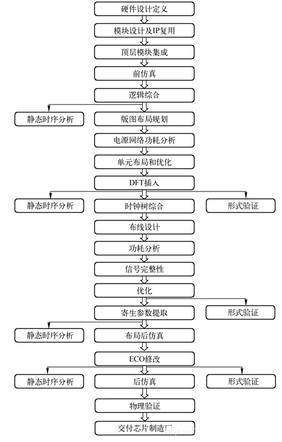

# EDA设计

## 1. EDA简介

* **EDA设计**(electronic design automation)是广义CAD的一种，是细分的**行业软件**。利用EDA工具，电子设计师可以从概念、算法、协议等开始设计电子系统，完成电子产品从电路设计、性能分析到设计出IC版图或PCB版图的整个过程。

<figure><figcaption>
EDA 设计相关工具
</figcaption></figure>

* **EDA 工具产业链**：EDA工具贯穿于**集成电路设计、制造、封测**等环节。一个完整的集成电路设计和 制造流程主要包括工艺平台开发、集成电路设计和集成电路制造三个阶段，均需要对应的 EDA 工具作为支撑，包括用于支撑工艺平台开发和集成电路制造两个阶段的**制造类** EDA 工具以及支撑集成电路设计阶段的**设计类** EDA 工具。

<figure><figcaption></figcaption></figure>

* **EDA 工具分类：EDA工具**分类繁多。按应用场景，EDA 工具通常可分为数字设计类、模拟设计类、 晶圆制造类、封装类、服务等五大类。**数字设计类工具**主要包括 RTL 编辑、功能仿真、 逻辑综合、形式验证等工具；**模拟设计类**工具主要包括版图设计与编辑、电路仿真、版图验证等工具；**晶圆制造类**工具主要包括器件建模、工艺和器件仿真（TCAD）、PDK 开发与验证、计算光刻、掩膜版校准、掩膜版合成和良率分析等。封装类工具主要是 面向芯片封装环节的设计、仿真、验证工具。根据 ESD 数据统计，**数字设计类 EDA 工具**和模拟设计类 EDA 工具占整体 EDA 市场的比例分列前两位，2020 年市场份额分 别达到 **65.0%** 和 17.1%, 前者为后者的接近 4 倍，这与下游数字芯片和模拟芯片市场比 例基本一致。

## 2. 发展阶段

EDA是电子设计自动化(Electronic Design Automation)的简称，是从计算机辅助设计(CAD)、计算机辅助制造(CAM)、计算机辅助测试(CAT)和计算机辅助工程(CAE)概念发展而来。

* 20 世纪 70年代，**早期阶段** (CAD阶段)：人们开始用**计算机辅助进行IC版图编辑、PCB布局布线**，取代了手工操作。相继出现了许多二维 CAD、三维 SAD 软件。
* 20 世纪 80年代，**发展阶段** (CAE阶段)：人们开始对相关软件进行进一步的开发，在把不同CAD工具合成一种系统的基础上，完善了电路功能设计和结构设计，通过电气连接网络表将两者结合在一起，实现了工程设计。CAE的主要功能是：原理图输入，逻辑仿真，电路分析，自动布局布线，PCB 后分析。EDA 技术在此时期逐渐发展成半导体芯片的设计，已经能生产出可编程半导体芯片。IC设计的 EDA 工具真正起步于80年代，1983年诞生了**第一台工作站平台 apollo**。
* 20 世纪 90年代，**成熟阶段**(EDA阶段)，在 20世纪90 年代以后，微电子技术获得了突飞猛进的发展，集成几千万乃至上亿的晶体管只需一个芯片。以**高级语言描述**、系统级仿真和综合技术为特点的 EDA 工具就此出现，此后EDA技术获得了极大的突破发展。
* 现代 EDA 时代：2000 年前后，EDA 在仿真验证和设计两个层面支持**标准硬件语言的 EDA 软件**工具功能更加强大，更大规模的可编程逻辑器件不断推出，系统级、 行为级硬件描述语言趋于更加高效和简单。目前 EDA 工具已能对集成电路的设计、制造、封装等环节实现全覆盖，**应用于包括模拟电路、数字电路、FPGA、PCB、面板**等多个领域的设计工作。

## 3. 产业情况

* EDA 是集成电路产业链中的上游，贯穿于集成电路设计、制造、封测等环节，支撑数千亿美元集成电路产业、万亿美元电子信息产业和数十万亿美元的数字经济。
* 全球 EDA 市场伴随集成电路产业发展。EDA 作为集成电路产业链中的上游，与下游景气度相关。根据 ESD Alliance 统计，2021 年全球 EDA 市场规模为 **132.75 亿美元**，同比增长 15.77%；2012-2021 年年均**复合增速为 8.19%**，与同期全球集成电路市场的 7.66% 年均复合增速相近。在近年来全球集成电路产业基本保持稳定向好的发展态势下，全球 EDA 市场规模呈加速增长趋势，2018-2021 年同比增速分别为 4.49%、 5.86%、11.62%、15.77%。
* 全球EDA市场产品**构成相对稳定**。ESD Alliance将全球EDA市场按产品分为SIP、CAE、IC 物理设计和验证、PCB & MCM 和服务，2021 年市场份额分别为 38%、31%、19%、 9%和 3%。2017-2021 年间，全球 EDA 市场产品份额相对稳定，**SIP 份额略**呈上升趋势。

## 4. EDA行业竞争格局

### 4.1 EDA行业壁垒

* **技术壁垒**：EDA 是**算法密集型**的大型工业软件系统，需要强大的数学基础理论支撑，且对算法的要求较高。此外，EDA 工具要尽可能准确的在软件中**重现和拟合现实中的物理和工艺问题**，设计工具和**制造工艺**紧密结合的重要性愈发突出。EDA 企业保持长久竞争力需要高强度、长周期的研发投入获得较 长时间的技术积累和专利积累，易形成较高的技术壁垒。
* **人才储备壁垒**：EDA 开发过程需要计算机、数学、物理、电子电路、工艺等多种学科和专业的高端人才，对综合技能要求很高，企业的人才储备决定其是否能够在行业中持续发展。行业头部公司均拥有经验丰富、实力雄厚的研 发队伍，其知名度、成熟培训体系等也能够持续吸引人才加入，研发人员规 模领先，形成了**人才壁垒**。2021 财年末，海外 EDA 巨头 Synopsys、Cadence 员工人数分别为 16361、9300，是支撑其在全球 EDA 市场获得较高市占率的重要因素之一。
* **用户协同壁垒**：EDA 工具的技术开发和商业销售依托于**制造、设计、EDA 行业三方**所形成的生态圈，需要产业链上下游的全力支持。国际 EDA 领域的领先企业与全球领先的集成电路制造和设计企业具备长期合作基础，其 EDA 工具工艺库信息完善，**能够随先进工艺演进不断迭代**，进一步巩固了竞争优势。 EDA 行业下游用户一旦确定了 EDA 供应商，短时间在内部更换 EDA 工具软件的成本较大，因此集成电路制造与设计企业对合作 EDA 工具供应商粘性较强。
* **资金规模壁垒**：为保持较高的行业竞争力，EDA 企业需要投入大量的**研发支出和并购支出**，因此形成了较高的资金规模壁垒。海外 EDA 巨头 Synopsys、 Cadence 持续加大研发投入，近十年研发费用分别累计为 627.41 亿元、508.92 亿元，平均研发费用率分别为 34.56%、38.90%

### 4.2 行业高度集中

* EDA三巨头：Synopsys，Cadence，Siemens EDA 具备对于半定制，全定制IC设计全流程的覆盖能力，市场占有率超过77%。
* ANSYS和是德科技（Keysight Technologies）为代表的国际领先 EDA 公司，凭借其在细分领域取得的技术领先优势，在特定的设计 环节或特定领域形成了其垄断地位，前五大 EDA 公司累计占有了超 85%的全球 EDA 市场份额。

